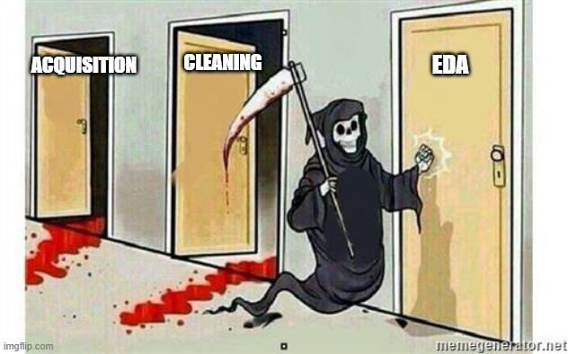

# Welcome!

This repo contains work completed contemporaneously with projects connected to my M.S.D.A. program and ongoing independent learning.

Each folder in this repo represents a self-contained project—cleaned, documented, and (in most cases) still under active development. Some projects are more refined than others and that’s intentional. This space reflects ongoing progress, driven by curiosity and the simple act of doing what I enjoy.

All datasets are obtained from public sources or generated via AI prompt.  Neither the data nor the projects bear any resemblance to actual school projects.

---

## 👋 About Me
Currently in search of a place to call work !

Experienced in data management, business process engineering, project management and quietly fixing things that don’t scale!

Other stuff I know about:
- Human Resources (current PHR) 
- Salesforce (Admin, Adv Admin, PAB)

---
## 📌 Why This Repo Exists

This space exists to reflect:
- What I’ve learned so far
- How I approach data problems
- My willingness to revise, iterate, and improve over time

It's not meant to be a final product—just a clear record of real work, real structure, and continuous growth.

---

## 🗂️ Projects Included

### [`glassdoor_reviews_sample`](./glassdoor_reviews_sample)
> A text analytics and sentiment project using a 100,000 record sample (out of 8M+) former employee reviews from Glassdoor. 
> Focused on profiling, visualizing, and eventually scoring open-ended feedback.

#### *CURRENT STATUS:*

---
<!-- Add future projects here in the same format -->

