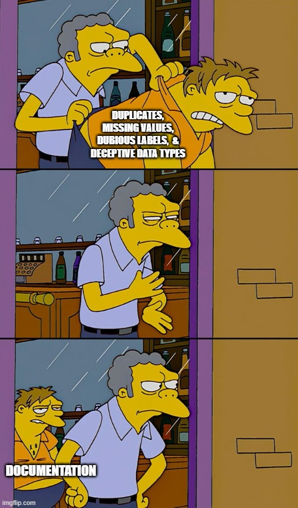

### 📂 Dataset Attribution

This project uses the [Glassdoor Job Reviews 2](https://www.kaggle.com/datasets/davidgauthier/glassdoor-job-reviews-2/data) dataset created by **David Gauthier**, hosted on Kaggle.

> © David Gauthier. Licensed under [Creative Commons Attribution-NonCommercial-ShareAlike 4.0 International (CC BY-NC-SA 4.0)](https://creativecommons.org/licenses/by-nc-sa/4.0/).

---

## Files in this folder:
> ### [`glassdoor_sample_former_employees_100k.csv`](./data/glassdoor_sample_former_employees_100k.csv)

- original sample

> ### [`01_data_cleaning.ipynb`](./data/01_data_cleaning.ipynb)

- data cleaning script

> ### [`cleaned_glassdoor_sample_data.csv`](./data/cleaned_glassdoor_sample_data.csv)

- data cleaning results

---
>### CURRENT STATUS:

---

## What's next?
> - Exploratory Data Analysis
> - Text data preprocessing
> - ????
> - Profit
---
